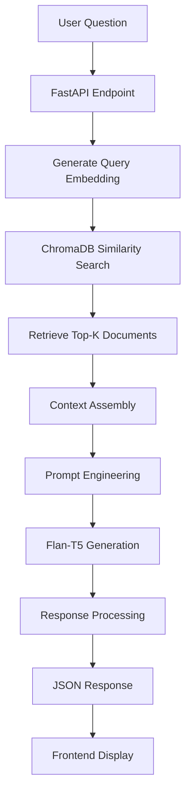

# Personal Digital Twin - RAG System

A sophisticated Retrieval-Augmented Generation (RAG) system that creates an interactive digital twin of Koutaiba Diab, enabling users to ask questions and receive personalized responses based on his profile, experience, and knowledge.

## 🎯 Project Overview

This project combines modern NLP techniques with a sleek web interface to create an intelligent digital assistant that can answer questions about Koutaiba's background, skills, projects, and experiences. The system uses semantic search to retrieve relevant context and generates natural language responses using a fine-tuned language model.

## 🏗️ System Architecture

```
Digital_Twin/
├── app.py                    # FastAPI backend server
├── page.html                 # Frontend web interface
├── data/
│   └── personal_data.json    # Knowledge base (45 Q&A pairs)
├── utils/
│   ├── embedding_utils.py    # ChromaDB initialization & embedding utilities
│   └── retrievle.py         # Document retrieval functions
├── embeddings/
│   └── chroma_db/           # Vector database storage
├── .env                     # Environment variables
└── requirements.txt         # Python dependencies
```

## 🔧 RAG System Components

### 1. Knowledge Base
- **Format**: Structured JSON containing instruction-input-output triplets
- **Content**: 45 comprehensive Q&A pairs covering:
  - Personal background and education
  - Technical skills and programming languages
  - Professional experience and internships
  - Projects and achievements
  - Interests and contact information

### 2. Embedding & Vector Storage
- **Embedding Model**: `all-MiniLM-L6-v2` (SentenceTransformers)
- **Vector Database**: ChromaDB with persistent storage
- **Search Method**: Semantic similarity using cosine distance
- **Retrieval**: Top-k relevant documents (configurable, default: 3)

### 3. Language Model
- **Model**: `google/flan-t5-base` (Encoder-Decoder Transformer)
- **Purpose**: Text generation with context awareness
- **Prompt Engineering**: Sophisticated prompt template for personalized responses
- **Response Style**: First-person, natural language with context-aware filtering

### 4. API Layer
- **Framework**: FastAPI with automatic OpenAPI documentation
- **Endpoint**: `/ask` - POST endpoint for question processing
- **Response Format**: JSON with question and generated answer
- **Error Handling**: Graceful degradation with user-friendly messages

### 5. Frontend Interface
- **Technology**: Vanilla HTML5, CSS3, JavaScript
- **Design**: Modern dark theme with glassmorphism effects
- **Features**:
  - Real-time chat interface
  - Typing indicators
  - Responsive design
  - Quick suggestion prompts
  - Auto-resizing text input

## 🚀 Key Features

### Advanced RAG Pipeline
1. **Query Processing**: Semantic embedding of user questions
2. **Context Retrieval**: ChromaDB similarity search for relevant documents
3. **Response Generation**: Flan-T5 model with engineered prompts
4. **Context Filtering**: Intelligent removal of irrelevant information
5. **Personalization**: First-person responses maintaining character consistency

### Smart Prompt Engineering
```python
input_text = (
    f"You are Koutaiba Diab's personal digital twin. "
    f"Use the retrieved context to answer the question accurately. "
    f"Select the most relevant information from the context and combine answers if needed. "
    f"Remove irrelevant information that does not answer the question. "
    f"If the question is about general knowledge not mentioned in the context, "
    f"answer based on your general knowledge and combine with Koutaiba-specific info if relevant. "
    f"Context: {context} "
    f"Question: {question} "
    f"Answer in a natural, clear, first-person way."
)
```

### Incremental Data Loading
- Automatic detection of existing embeddings
- Efficient addition of new documents
- Persistent vector storage to avoid recomputation

## 🛠️ Technology Stack

**Backend:**
- FastAPI (Web framework)
- ChromaDB (Vector database)
- SentenceTransformers (Embedding generation)
- Transformers (Language model)
- Pydantic (Data validation)

**Frontend:**
- HTML5/CSS3 (Structure & styling)
- JavaScript (Interactivity)
- Modern CSS features (Grid, Flexbox, CSS Variables)
- Responsive design principles

**AI/ML:**
- `all-MiniLM-L6-v2` (384-dimensional embeddings)
- `google/flan-t5-base` (Text generation)
- Semantic search with cosine similarity
- Context-aware prompt engineering

## 🚀 Installation & Setup

### Prerequisites
- Python 3.8+
- Git

### Setup Instructions

1. **Clone the repository**
```bash
git clone <repository-url>
cd Digital_Twin
```

2. **Create virtual environment**
```bash
python -m venv .venv
source .venv/bin/activate  # On Windows: .venv\Scripts\activate
```

3. **Install dependencies**
```bash
pip install fastapi uvicorn
pip install sentence-transformers
pip install chromadb
pip install transformers
pip install torch
```

4. **Initialize the vector database**
```bash
python utils/embedding_utils.py
```

5. **Start the server**
```bash
uvicorn app:app --reload --host 0.0.0.0 --port 8000
```

6. **Access the application**
Open your browser and navigate to `http://localhost:8000`

## 🎮 Usage Examples

**Personal Information:**
- "Who are you?"
- "Tell me about your background"
- "What's your educational background?"

**Technical Skills:**
- "What programming languages do you know?"
- "What are your main skills?"
- "Which frameworks do you use?"

**Professional Experience:**
- "Tell me about your work experience"
- "Where did you intern?"
- "What projects have you built?"

**Personal Interests:**
- "What sports do you play?"
- "Which football teams do you support?"
- "What's your favorite food?"

## 📊 Performance Characteristics

- **Response Time**: ~2-5 seconds (including model inference)
- **Embedding Dimension**: 384 (all-MiniLM-L6-v2)
- **Context Window**: 512 tokens (input truncation)
- **Generation Length**: Up to 300 tokens
- **Memory Usage**: ~2GB RAM for full pipeline
- **Storage**: ~50MB for embeddings and models

## 🔄 System Flow



## 🚧 Future Enhancements

- [ ] **Multi-modal Support**: Image and document processing
- [ ] **Conversation Memory**: Multi-turn dialogue context
- [ ] **Advanced Retrieval**: Hybrid search (semantic + keyword)
- [ ] **Model Upgrades**: Integration with larger language models
- [ ] **Analytics Dashboard**: Usage metrics and conversation insights
- [ ] **API Authentication**: Secure access controls
- [ ] **Caching Layer**: Redis for improved response times
- [ ] **Database Integration**: PostgreSQL for structured data

## 🤝 Contributing

1. Fork the repository
2. Create a feature branch (`git checkout -b feature/amazing-feature`)
3. Commit your changes (`git commit -m 'Add amazing feature'`)
4. Push to the branch (`git push origin feature/amazing-feature`)
5. Open a Pull Request

## 📄 License

This project is licensed under the MIT License - see the [LICENSE](LICENSE) file for details.

## 👨‍💻 About the Author

**Koutaiba Diab** - Computer Science student at Global University, Beirut
- 📧 Email: koutaibadiab23@gmail.com
- 🔗 LinkedIn: [linkedin.com/in/koutaiba-diab](https://www.linkedin.com/in/koutaiba-diab/)
- 🌐 Portfolio: [koutaiba.vercel.app](https://koutaiba.vercel.app/)
- 💻 GitHub: [github.com/koutaiba141](https://github.com/koutaiba141)

---

*Built with ❤️ using RAG technology to create an intelligent digital twin experience.*
